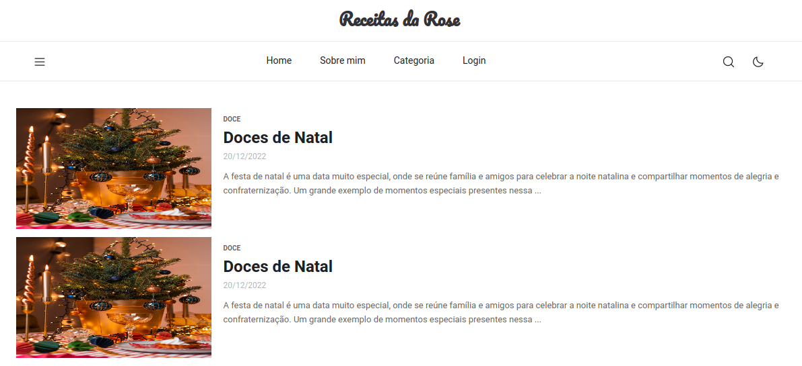

<h1 align="center">
  <a href="https://receitasdarose.netlify.app/" target="_blank">
    Receitas da Rose
  </a>
</h1>

<p align="center">
  <a href="#-technologies">Technologies</a>&nbsp;&nbsp;&nbsp;|&nbsp;&nbsp;&nbsp;
  <a href="#-getting-started">Getting started</a>&nbsp;&nbsp;&nbsp;|&nbsp;&nbsp;&nbsp;
  <a href="#-project">Project</a>&nbsp;&nbsp;&nbsp;|&nbsp;&nbsp;&nbsp;
  <a href="#-layout">Layout</a>&nbsp;&nbsp;&nbsp;|&nbsp;&nbsp;&nbsp;
  <a href="#-next-steps">Next steps</a>
</p>

---

## 🧪 Technologies

This project was developed using the following technologies:

- [React](https://pt-br.reactjs.org/)
- [Typescript](https://www.typescriptlang.org/)
- [Firebase](https://firebase.google.com/)
- [Styled Components](https://styled-components.com/)
- [React Toastify](https://fkhadra.github.io/react-toastify/introduction)
- [React Router DOM](https://reactrouter.com/)
- [React Hook Form](https://react-hook-form.com/)
- [Phosphor Icons](https://phosphoricons.com/)
- [Vite](https://vitejs.dev/)
- [Date fns](https://date-fns.org/)
- [Zod](https://zod.dev/)

## 🚀 Getting started

Clone the project and access the folder

```bash
$ git clone https://github.com/eltonsantos/receitasdarose.git && cd receitasdarose
```

Follow the steps below

```bash
# Install the dependencies
$ npm install

# Start the project
$ npm run dev
```

## 💻 Project

A personal blog of cooking recipes developed for Rosiane Rosa.

## 🔖 Layout

<p align="center">
  
</p>

## 🐾 Next steps

###### Escreverei essa parte em português

- [ ] Cobrir o sistema de testes! 👁‍🗨
- [ ] Terminar o menu responsivo que aparecerá na lateral 🍔
- [ ] Criar uma busca por nome das receitas e categorias 🔎
- [ ] Alterar visual em dark/light mode 🌗
- [ ] Criar paginação 🥖
- [ ] E muito mais... 💜💪🏼

---

## 👨🏻‍💻 Author

<h3 align="center">
  
  <br/>
  <strong>Elton Santos</strong> 🚀
  <br/>
  <br/>

 <a href="https://www.linkedin.com/in/eltonmelosantos" alt="LinkedIn" target="blank">
    
  </a>

  <a href="mailto:elton.melo.santos@gmail.com?subject=Olá%20Elton" alt="Email" target="blank">
    
  </a>

<br/>

Made with ❤️ by Elton Santos 👋🏽 [Entre em contato!](https://www.linkedin.com/in/eltonmelosantos/)

</h3>
